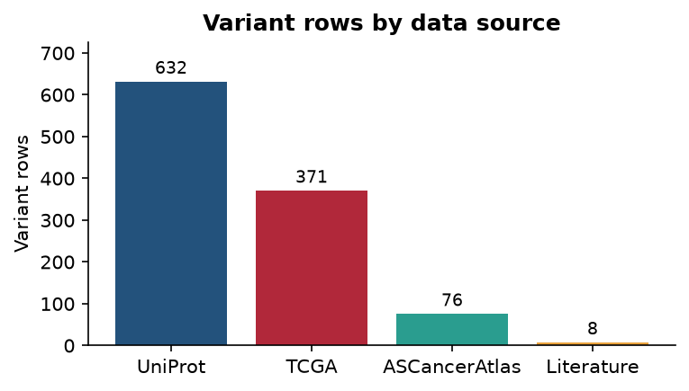
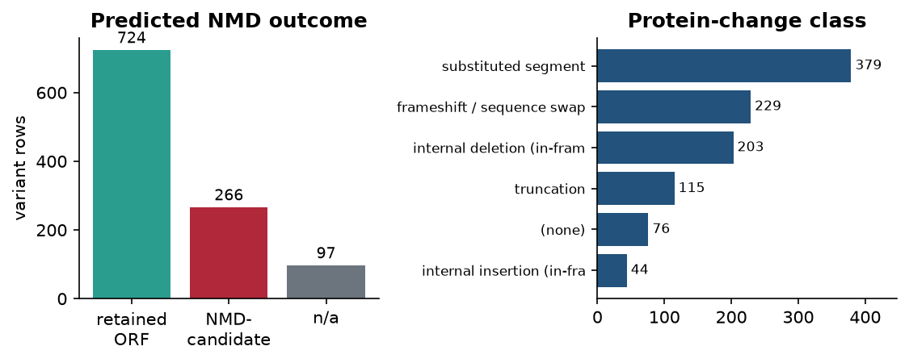
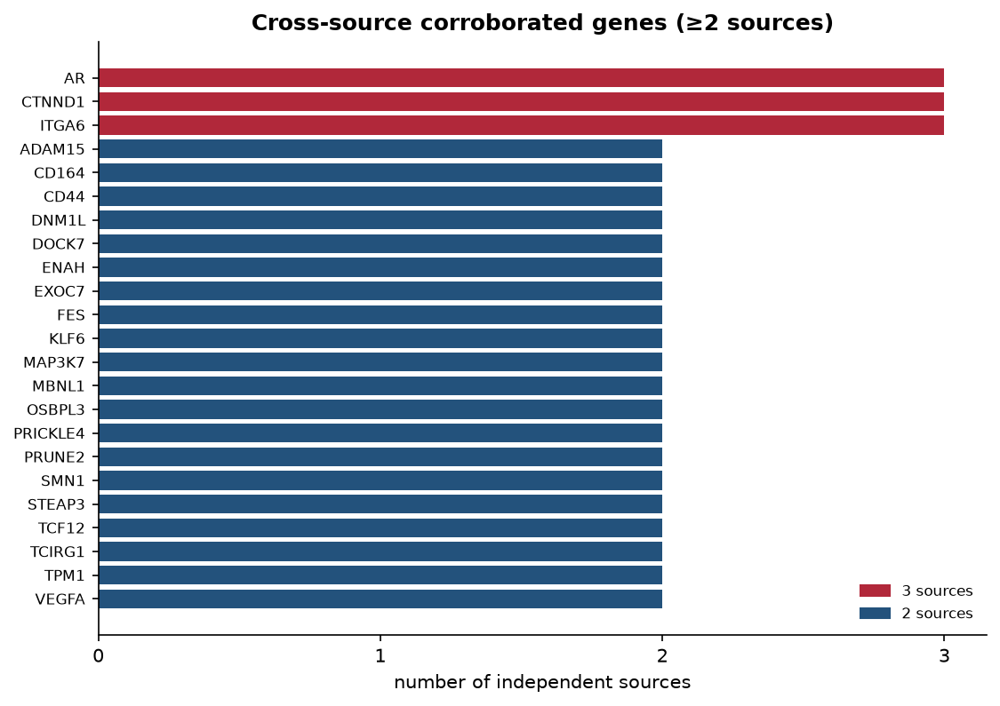
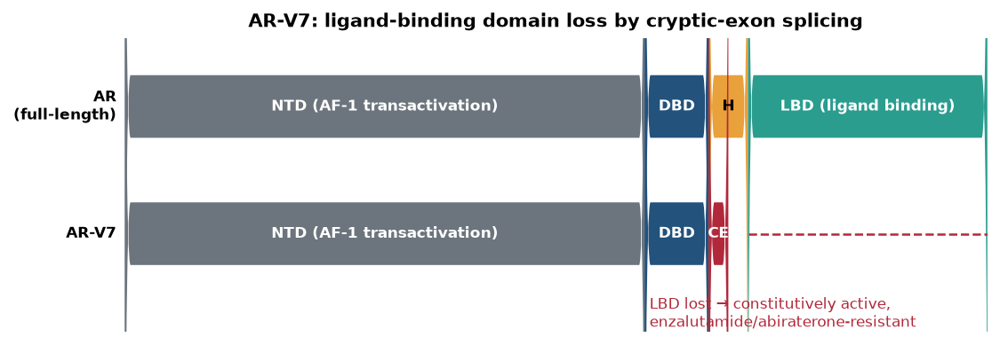
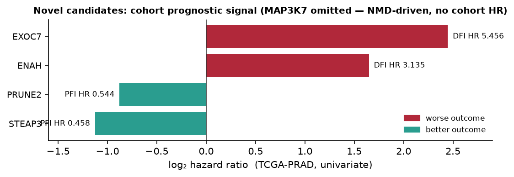

# Alternative Splicing in Prostate Cancer

*A multi-source integration of curated isoforms, cohort splicing events, literature variants and normal-tissue baseline — with predicted protein-functional impact.*

_Generated 2026-06-21 · Sources: UniProt · TCGA SpliceSeq PRAD · ASCancerAtlas · literature (EuropePMC) · GTEx v8 baseline._

| Variant rows | Genes | Domain-disrupting | NMD-candidates | Multi-source genes |
|---|---|---|---|---|
| 1087 | 600 | 487 | 266 | 23 |

## 1 · Executive summary

This report integrates **1087 alternative-splicing variant records across 600 genes** from four independent sources into one schema, then annotates each with predicted protein-functional consequences (domain disruption, nonsense-mediated-decay candidacy, localization signals) using UniProt feature tracks, and contextualises them against the GTEx normal-prostate baseline. 487 records disrupt at least one annotated domain or region and 266 are predicted NMD candidates. **23 genes are corroborated by ≥2 independent sources** (of which 3 by three), forming the highest-confidence shortlist. The androgen-receptor (AR) splicing axis — headlined by AR-V7 — is the dominant splicing-driven mechanism of therapeutic resistance.

- **UniProt**: 632 variant rows
- **TCGA**: 371 variant rows
- **ASCancerAtlas**: 76 variant rows
- **Literature**: 8 variant rows



## 2 · Methods (brief)

Every source is normalised into a 20-column master schema (`master_variants.tsv`). For each variant the canonical and alternative protein sequences are aligned to a common prefix/suffix; the resulting *changed interval* is intersected with UniProt feature tracks (domains, binding sites, zinc-fingers, DNA-binding regions, signal/transmembrane segments) to call domain disruption and localization changes. A C-terminal truncation losing >50 aa flags a protein-level NMD candidate (heuristic). Genes are cross-tabulated by source to compute corroboration. GTEx v8 median transcript expression provides a normal-prostate isoform baseline.

> **Interpretation note.** Disease, resistance, NMD and domain-disruption statements are **predictions or literature-curated annotations**, not measurements produced by this pipeline. Cohort hazard ratios are univariate, single-cohort, and some Cox fits are numerically unstable. CancerSplicingQTL was unreachable (HTTP 403) and is omitted.

## 3 · Predicted functional-impact landscape



In-frame substituted segments and internal deletions dominate, but a substantial tail of frameshift and truncating events feeds the 266-strong NMD-candidate pool — isoforms most likely to remove protein rather than remodel it.

## 4 · Cross-source corroboration

Genes recovered independently by more than one source are the most defensible leads. Three genes — **AR, ITGA6, CTNND1** — appear in three sources each.



| Gene | Sources | Source set | Variants | Best PCa evidence |
|------|:-------:|-----------|:--------:|-------------------|
| **AR** | 3 | ASCancerAtlas, Literature, UniProt | 10 | Prostate cancer, hereditary, X-linked 3 |
| **CTNND1** | 3 | ASCancerAtlas, TCGA, UniProt | 36 | cohort PFI HR 0.45 |
| **ITGA6** | 3 | ASCancerAtlas, TCGA, UniProt | 9 | cohort PFI HR 2.474 |
| **ADAM15** | 2 | ASCancerAtlas, TCGA | 3 | cohort PFI HR 0.348 |
| **CD164** | 2 | ASCancerAtlas, UniProt | 5 | ASCancerAtlas PRAD |
| **CD44** | 2 | ASCancerAtlas, TCGA | 4 | cohort PFI HR 2.361 |
| **DNM1L** | 2 | ASCancerAtlas, TCGA | 2 | cohort DFI HR 2.855 |
| **DOCK7** | 2 | ASCancerAtlas, TCGA | 2 | cohort PFI HR 0.29 |
| **ENAH** | 2 | ASCancerAtlas, TCGA | 2 | cohort DFI HR 3.135 |
| **EXOC7** | 2 | ASCancerAtlas, TCGA | 6 | cohort DFI HR 5.456 |
| **FES** | 2 | TCGA, UniProt | 4 | cohort PFI HR 3.589 |
| **KLF6** | 2 | Literature, UniProt | 3 | Prostate cancer |
| **MAP3K7** | 2 | ASCancerAtlas, UniProt | 4 | ASCancerAtlas PRAD |
| **MBNL1** | 2 | ASCancerAtlas, TCGA | 3 | cohort PFI HR 2.511 |
| **OSBPL3** | 2 | ASCancerAtlas, TCGA | 2 | cohort DFI HR 3.355 |
| **PRICKLE4** | 2 | TCGA, UniProt | 3 | cohort PFI HR 4.348 |
| **PRUNE2** | 2 | TCGA, UniProt | 5 | cohort PFI HR 0.544 |
| **SMN1** | 2 | TCGA, UniProt | 4 | cohort PFI HR 1.691 |
| **STEAP3** | 2 | TCGA, UniProt | 4 | cohort PFI HR 0.458 |
| **TCF12** | 2 | ASCancerAtlas, TCGA | 2 | cohort DFI HR 0.327 |
| **TCIRG1** | 2 | ASCancerAtlas, TCGA | 2 | cohort PFI HR 4.328 |
| **TPM1** | 2 | ASCancerAtlas, TCGA | 3 | cohort PFI HR 0.416 |
| **VEGFA** | 2 | ASCancerAtlas, UniProt | 17 | ASCancerAtlas PRAD |

## 5 · Top 5 splicing cases most relevant to prostate cancer

Ranked by strength and independence of evidence, fidelity of the predicted mechanism, and established prostate-cancer / therapy-resistance relevance.



### #1 · AR — AR-V7 / AR-V567es  (`P10275`)
*Evidence: UniProt + Literature + ASCancerAtlas*

- **Splicing event:** Cryptic-exon inclusion / exon skipping truncating the ligand-binding domain (LBD).
- **Predicted protein impact:** Loss of the C-terminal NR ligand-binding domain (pipeline changed-interval overlaps “NR LBD; Nuclear receptor”; flagged NMD-candidate). The DNA-binding domain and transactivation region are retained → a constitutively active, ligand-independent receptor.
- **Prostate-cancer relevance:** The premier driver of castration-resistant prostate cancer (CRPC). AR-V7 is a clinically validated biomarker of resistance to enzalutamide and abiraterone; AR-V567es drives ligand-independent signalling in CRPC.
- **Why it ranks here:** Highest-confidence case: corroborated across three independent sources, the pipeline reproduces the known LBD-loss mechanism, and it is the best-established splicing-driven resistance axis in the disease.

### #2 · ITGA6 — Integrin α6 isoforms (P23229-2/-4/-7)  (`P23229`)
*Evidence: UniProt + TCGA + ASCancerAtlas*

- **Splicing event:** Exon skipping / substituted segments across the extracellular β-propeller.
- **Predicted protein impact:** Changed intervals repeatedly overlap FG-GAP propeller repeats (FG-GAP 1–7) and ligand-interaction regions; several isoforms are flagged NMD-candidate. Predicted disruption of laminin engagement and integrin signalling.
- **Prostate-cancer relevance:** Integrin α6 governs tumour-cell adhesion, migration and invasion; isoform switching is linked to a more invasive phenotype. Corroborated by an adverse cohort progression signal.
- **Why it ranks here:** Three-source corroboration plus a clear, repeated domain-disruption + NMD signal on an adhesion/invasion gene.

### #3 · CTNND1 — p120-catenin isoforms (incl. p120-1A/-1AB)  (`O60716`)
*Evidence: UniProt + TCGA + ASCancerAtlas*

- **Splicing event:** Alternative N-terminal start / internal exon usage across the armadillo (ARM) repeat region.
- **Predicted protein impact:** Isoforms remodel the ARM-repeat cadherin-binding surface and nuclear-localization signals (pipeline shows ARM-repeat and NLS overlap). Shifts the balance between cadherin stabilisation and Rho-GTPase / transcriptional signalling.
- **Prostate-cancer relevance:** p120-catenin isoform switching (toward the N-terminally longer isoform 1) accompanies loss of epithelial adhesion and is associated with invasive prostate carcinoma; corroborated by a cohort progression signal.
- **Why it ranks here:** Three-source corroboration on a core adhesion regulator with a concrete domain-level mechanism.

### #4 · KLF6 — KLF6-SV1  (`Q99612`)
*Evidence: Literature + UniProt*

- **Splicing event:** Alternative 5′ splice-site use producing a truncated, zinc-finger–deficient isoform.
- **Predicted protein impact:** Loss of the DNA-binding C2H2 zinc-finger domain converts a tumour-suppressor transcription factor into a dominant-negative product that antagonises wild-type KLF6.
- **Prostate-cancer relevance:** KLF6-SV1 over-expression is associated with aggressive, treatment-refractory prostate cancer and poorer outcome — a splicing event that inactivates a tumour suppressor.
- **Why it ranks here:** Literature-curated with UniProt support; a clean example of splicing-driven tumour-suppressor inactivation distinct from the AR axis.

### #5 · CCND1 — Cyclin D1b  (`P24385`)
*Evidence: Literature + UniProt*

- **Splicing event:** Intron-4 retention producing an alternative C-terminus.
- **Predicted protein impact:** Loss of Thr286, the residue required for nuclear export and degradation → nuclear retention of a stabilised cyclin D1 that also gains AR-coactivator activity.
- **Prostate-cancer relevance:** Cyclin D1b enhances AR transcriptional output and proliferation; a G870A germline polymorphism biasing its production is linked to prostate-cancer risk and progression.
- **Why it ranks here:** Mechanistically crisp single-residue consequence that ties the cell-cycle machinery directly back to AR signalling.

## 6 · Novel but credible candidates

The cases above are well-established biology. This section asks the complementary question: which splicing events are **under-studied in prostate cancer yet credible**? Each gene below is independently relevant to prostate cancer while its *splicing* consequence is largely unexplored — surfaced by corroboration, a cohort signal, or a predicted NMD/domain hit. Hypothesis-generating leads, not established mechanisms.



### N1 · MAP3K7 — TAK1 NMD-candidate isoforms  (`O43318`)
*Evidence: UniProt + ASCancerAtlas · 2 NMD-candidate isoforms; kinase-domain region affected*

- **Splicing event:** Truncating / frame-disrupting splicing predicted to trigger nonsense-mediated decay.
- **Established PCa context:** MAP3K7 (TAK1) **deletion** is among the best-characterised events in aggressive PCa (~30–40% of tumours; CHD1 co-deletion drives AR target genes, AR-V7, and enzalutamide resistance).
- **Why it is novel yet credible:** That body of work is about copy-number loss — not splicing. A splicing route to MAP3K7 loss-of-function would phenocopy the deletion, and our NMD-candidate isoforms point exactly there.

### N2 · EXOC7 — Exo70 epithelial/mesenchymal switch  (`Q9UPT5`)
*Evidence: TCGA + ASCancerAtlas · Strongest cohort signal in the table (DFI HR ≈ 5.5, risk-up)*

- **Splicing event:** Exocyst Exo70 isoform switching (alternative exon usage).
- **Established PCa context:** Exo70 epithelial↔mesenchymal isoform switching is a proven, ESRP1-controlled invasion driver in breast and colon cancer (mesenchymal isoform recruits Arp2/3 for actin remodelling).
- **Why it is novel yet credible:** Never tested in prostate, yet it carries the single strongest prognostic signal across the whole cohort and is corroborated by two sources — a high-value, untested mechanism.

### N3 · PRUNE2 — PRUNE2 isoforms (PCA3 locus)  (`Q8WUY3`)
*Evidence: TCGA + UniProt · 4 domain-overlapping isoforms; protective PFI HR ≈ 0.54*

- **Splicing event:** Alternative splicing producing multiple PRUNE2 transcripts.
- **Established PCa context:** PRUNE2 is the validated tumour suppressor at the PCA3 locus — PCA3 being the clinically used prostate-cancer biomarker lncRNA that down-regulates PRUNE2.
- **Why it is novel yet credible:** Maximally prostate-specific credibility, but the individual PRUNE2 isoforms and their suppressor activity remain uncharacterised — a focused splicing question on a marquee prostate gene.

### N4 · ENAH — Mena invasion isoforms (MenaINV / 11a)  (`Q8N8S7`)
*Evidence: TCGA + ASCancerAtlas · Corroborated; DFI HR ≈ 3.1 (risk-up)*

- **Splicing event:** Inclusion of invasion-associated exons (exon 4 / 11a).
- **Established PCa context:** MenaINV and Mena11a are textbook invasion / EMT splicing switches in breast and lung carcinoma.
- **Why it is novel yet credible:** The prostate literature is essentially empty, yet the same actin-regulatory invasion machinery is corroborated here with an adverse cohort signal.

### N5 · STEAP3 — STEAP3 metalloreductase isoforms  (`Q658P3`)
*Evidence: TCGA + UniProt · Domain-overlapping isoforms; protective PFI HR ≈ 0.46*

- **Splicing event:** Alternative splicing of the STEAP3 transmembrane reductase.
- **Established PCa context:** STEAP3 belongs to the six-transmembrane epithelial-antigen-of-prostate family (STEAP1/2 are PCa therapy targets); it is a p53-inducible metalloreductase up-regulated across cancers.
- **Why it is novel yet credible:** Its splicing is uncharacterised in prostate cancer despite the family's standing as prostate antigens — an under-explored but well-grounded lead.

> **Credibility caveat.** The supporting hazard ratios are univariate, single-cohort TCGA-PRAD signals and the NMD/domain calls are predictions; each candidate needs exon-level validation. EXOC7 carries the strongest signal but is the most speculative-by-magnitude.

## 7 · Limitations

- Functional calls (NMD, domain disruption, disease/resistance links) are predictions or curated annotations, not measurements from this analysis.
- Cross-source corroboration is gene-level, not exon/variant-level.
- UniProt isoforms and literature variants are curated presence/absence; GTEx provides normal context only; TCGA cohort HRs are univariate, single-cohort, and occasionally numerically degenerate.
- The NMD rule is a protein-length heuristic, not a transcript-level 55-nt-rule evaluation.
- CancerSplicingQTL was unreachable (HTTP 403) and is omitted.

## 8 · Reproducibility

Generated from `results_collected/master_variants.tsv` and `gtex_prostate_baseline.tsv` via `analysis/build_pdf_report.py`. Collection and integration steps are documented in `results_collected/README.md`.

## Appendix A · Before / after protein sequences

For each featured case (Sections 5 & 6), the canonical/reference protein sequence and the alternative isoform are shown with the changed region wrapped in **«…»** markers. Long identical flanks — and any unusually long changed stretch — are elided with `…[N aa identical]…` markers; the **complete** before/after sequences (18) are in [`results_collected/featured_sequences.fasta`](../results_collected/featured_sequences.fasta).

### AR — Top 5 · UniProt `P10275-3`
AR-V7 (LBD lost) · substituted segment · before 920 aa → after 644 aa · changed from residue 629

```text
BEFORE: …[568 aa identical]…GCHYGALTCGSCKVFFKRAAEGKQKYLCASRNDCTIDKFRRKNCPSCRLRKCYEAGMTLG«ARKLKKLGNLKLQEEGEASSTTSPTEETTQKLTVSHIEGYECQPIFLNVLEAIEPGVVCAGHDNNQPDSFAALLSSLNELGERQLVHVVKWAKALPGFRNLHVDDQMAVIQYSWMGLMVFAMGWRSFTNVNSRMLYFAPDLVFNEYRMHKSRMYSQCVRMRHLSQEFGWLQITPQEFLCMKALLLFSIIPVDGLKNQKFFDELRMNYIKELDRIIACKRKNPTSCSRRFYQLTKLLDSVQPIARELHQFTFDLLIKSHMVSVDFPEMMAEIISVQVPKILSGKVKPIYFHTQ»
AFTER : MEVQLGLGRVYPRPPSKTYRGAFQNLFQSVREVIQNPGPRHPEAASAAPPGASLLLLQQQQQQQQQQQQQQQQQQQQQQQETSPRQQQQQQGEDGSPQAHRRGPTGYLVLDEEQQPSQPQSALECHPERGCVPEPGAAVAASKGLPQQLPAPPDEDDSAAPSTLSLLGPTFPGLSSCSADLKDILSEASTMQLLQQQQQEAVSEGSSSGRAREASGAPTSSKDNYLGGTSTISDNAKELCKAVSVSMGLGVEALEHLSPGEQLRGDCMYAPLLGVPPAVRPTPCAPLAECKGSLLDDSAGKSTEDTAEYSPFKGGYTKGLEGESLGCSGSAAAGSSGTLELPSTLSLYKSGALDEAAAYQSRDYYNFPLALAGPPPPPPPPHPHARIKLENPLDYGSAWAAAAAQCRYGDLASLHGAGAAGPGSGSPSAAASSSWHTLFTAEEGQLYGPCGGGGGGGGGGGGGGGGGGGGGGGEAGAVAPYGYTRPPQGLAGQESDFTAPDVWYPGGMVSRVPYPSPTCVKSEMGPWMDSYSGPYGDMRLETARDHVLPIDYYFPPQKTCLICGDEASGCHYGALTCGSCKVFFKRAAEGKQKYLCASRNDCTIDKFRRKNCPSCRLRKCYEAGMTLG«EKFRVGNCKHLKMTRP»
```

### ITGA6 — Top 5 · UniProt `P23229-2`
β-propeller isoform · substituted segment · before 1130 aa → after 1073 aa · changed from residue 260

```text
BEFORE: …[199 aa identical]…FHYIVFGAPGTYNWKGIVRVEQKNNTFFDMNIFEDGPYEVGGETEHDESLVPVPANSYLG«LLFLTSVSYTDPDQFVYKTRPPREQPDTFPDVMMNSYLGFSLDSGKGIVSKDEITFVSGAPRANHSGAVVLLKRDMKSAHLLPEHIFDGEGLASSFGYDVAVVDLNKDGWQDIVIGAPQYFDRDGEVGGAVYVYMNQQGRWNNVKPIRLNGTKDSMFGIAVKNIGDINQDGYPDIAVGAP…[511 aa, changed]…NRKFSLFAERKYQTLNCSVNVNCVNIRCPLRGLDSKASLILRSRLWNSTFLEEYSKLNYLDILMRAFIDVTAAAENIRLPNAGTQVRVTVFPSKTVAQYSGVPWWIILVAILAGILMLALLVFILWKCGFFKRSRYDDSVPRYHAVRIRKEEREIKDEKYIDNLEKKQWITKWNENESYS»
AFTER : …[199 aa identical]…FHYIVFGAPGTYNWKGIVRVEQKNNTFFDMNIFEDGPYEVGGETEHDESLVPVPANSYLG«FSLDSGKGIVSKDEITFVSGAPRANHSGAVVLLKRDMKSAHLLPEHIFDGEGLASSFGYDVAVVDLNKDGWQDIVIGAPQYFDRDGEVGGAVYVYMNQQGRWNNVKPIRLNGTKDSMFGIAVKNIGDINQDGYPDIAVGAPYDDLGKVFIYHGSANGINTKPTQVLKGISPYFGYSIAGN…[454 aa, changed]…ESHNSRKKREITEKQIDDNRKFSLFAERKYQTLNCSVNVNCVNIRCPLRGLDSKASLILRSRLWNSTFLEEYSKLNYLDILMRAFIDVTAAAENIRLPNAGTQVRVTVFPSKTVAQYSGVPWWIILVAILAGILMLALLVFILWKCGFFKRNKKDHYDATYHKAEIHAQPSDKERLTSDA»
```

### CTNND1 — Top 5 · UniProt `O60716-2`
p120-1AB · internal deletion (in-frame) · before 968 aa → after 962 aa · changed from residue 626

```text
BEFORE: …[565 aa identical]…IGQKDSDSKLVENCVCLLRNLSYQVHREIPQAERYQEAAPNVANNTGPHAASCFGAKKGK«DEWFSR»GKKPIEDPANDTVDFPKRTSPARGYELLFQPEVVRIYISLLKESKTPAILEASAGAIQNL…[277 aa identical]…
AFTER : …[565 aa identical]…IGQKDSDSKLVENCVCLLRNLSYQVHREIPQAERYQEAAPNVANNTGPHAASCFGAKKGK«»GKKPIEDPANDTVDFPKRTSPARGYELLFQPEVVRIYISLLKESKTPAILEASAGAIQNL…[277 aa identical]…
```

### KLF6 — Top 5 · UniProt `Q99612-3`
truncated isoform · substituted segment · before 283 aa → after 237 aa · changed from residue 227

```text
BEFORE: MDVLPMCSIFQELQIVHETGYFSALPSLEEYWQQTCLELERYLQSEPCYVSASEIKFDSQEDLWTKIILAREKKEESELKISSSPPEDTLISPSFCYNLETNSLNSDVSSESSDSSEELSPTAKFTSDPIGEVLVSSGKLSSSVTSTPPSSPELSREPSQLWGCVPGELPSPGKVRSGTSGKPGDKGNGDASPDGRRRVHRCHFNGCRKVYTKSSHLKAHQRTHTG«EKPYRCSWEGCEWRFARSDELTRHFRKHTGAKPFKCSHCDRCFSRSDHLALHMKRHL»
AFTER : MDVLPMCSIFQELQIVHETGYFSALPSLEEYWQQTCLELERYLQSEPCYVSASEIKFDSQEDLWTKIILAREKKEESELKISSSPPEDTLISPSFCYNLETNSLNSDVSSESSDSSEELSPTAKFTSDPIGEVLVSSGKLSSSVTSTPPSSPELSREPSQLWGCVPGELPSPGKVRSGTSGKPGDKGNGDASPDGRRRVHRCHFNGCRKVYTKSSHLKAHQRTHTG«VFPGLTTWPCT»
```

### CCND1 — Top 5 · Literature
*cyclin D1b — not in pipeline sources.* No before/after protein sequence in the pipeline's UniProt or TCGA sources for this literature-curated variant; see its PMID provenance in the master table.

### MAP3K7 — Novel · UniProt `O43318-4`
NMD-candidate truncation · substituted segment · before 606 aa → after 491 aa · changed from residue 404

```text
BEFORE: MSTASAASSSSSSSAGEMIEAPSQVLNFEEIDYKEIEVEEVVGRGAFGVVCKAKWRAKDVAIKQIESESERKAFIVELRQLSRVNHPNIVKLYGACLNPVCLVMEYAEGGSLYNVLHGAEPLPYYTAAHAMSWCLQCSQGVAYLHSMQPKALIHRDLKPPNLLLVAGGTVLKICDFGTACDIQTHMTNNKGSAAWMAPEVFEGSNYSEKCDVFSWGIILWEVITRRKPFDEIGGPAFRIMWAVHNGTRPPLIKNLPKPIESLMTRCWSKDPSQRPSMEEIVKIMTHLMRYFPGADEPLQYPCQYSDEGQSNSATSTGSFMDIASTNTSNKSDTNMEQVPATNDTIKRLESKLLKNQAKQQSESGRLSLGASRGSSVESLPPTSEGKRMSADMSEIEARIAATT«AYSKPKRGHRKTASFGNILDVPEIVISGNGQPRRRSIQDLTVTGTEPGQVSSRSSSPSVRMITTSGPTSEKPTRSHPWTPDDSTDTNGSDNSIPMAYLTLDHQLQPLAPCPNSKESMAVFEQHCKMAQEYMKVQTEIALLLQRKQELVAELDQDEKDQQNTSRLVQEHKKLLDENKSLSTYYQQCKKQLEVIRSQQQKRQGTS»
AFTER : MSTASAASSSSSSSAGEMIEAPSQVLNFEEIDYKEIEVEEVVGRGAFGVVCKAKWRAKDVAIKQIESESERKAFIVELRQLSRVNHPNIVKLYGACLNPVCLVMEYAEGGSLYNVLHGAEPLPYYTAAHAMSWCLQCSQGVAYLHSMQPKALIHRDLKPPNLLLVAGGTVLKICDFGTACDIQTHMTNNKGSAAWMAPEVFEGSNYSEKCDVFSWGIILWEVITRRKPFDEIGGPAFRIMWAVHNGTRPPLIKNLPKPIESLMTRCWSKDPSQRPSMEEIVKIMTHLMRYFPGADEPLQYPCQYSDEGQSNSATSTGSFMDIASTNTSNKSDTNMEQVPATNDTIKRLESKLLKNQAKQQSESGRLSLGASRGSSVESLPPTSEGKRMSADMSEIEARIAATT«GNGQPRRRSIQDLTVTGTEPGQVSSRSSSPSVRMITTSGPTSEKPTRSHPWTPDDSTDTNGSDNSIPMAYLTLDHQLQARTSCRTGPG»
```

### EXOC7 — Novel · TCGA `EXOC7_ES_43570`
DFI HR 5.456 event · frameshift / sequence swap · before 653 aa → after 735 aa · changed from residue 271

```text
BEFORE: MIPPQEASARRREIEDKLKQEEETLSFIRDSLEKSDQLTKNMVSILSSFESRLMKLENSIIPVHKQTENLQRLQENVEKTLSCLDHVISYYHVASDTEKIIREGPTGRLEEYLGSMAKIQKAVEYFQDNSPDSPELNKVKLLFERGKEALESEFRSLMTRHSKVVSPVLILDLISGDDDLEAQEDVTLEHLPESVLQDVIRISRWLVEYGRNQDFMNVYYQIRSSQLDRSIKGLKEHFHKSSSSSGVPYSPAIPNKRKDTPTKKPVKRPG«»RDDMLDVETDAYIHCVSAFVKLAQSEYQLLADIIPEHHQKKTFDSLIQDALDGLMLEGENIVSAARKAIVRHDFSTVLTVFPILRHLKQTKPEFDQVLQGTAASTKNKLPGLITSMETIGAKALEDFADNIKNDPDKEYNMPKDGTVHELTSNAILFLQQLLDFQETAGAMLASQETSSSATSYSSEFSKRLLSTYICKVLGNLQLNLLSKSKVYEDPALSAIFLHNNYNYILKSLEKSELIQLVAVTQKTAERSYREHIEQQIQTYQRSWLKVTDYIAEKNLPVFQPGVKLRDKERQIIKERFKGFNDGLEELCKIQKAWAIPDTEQRDRIRQAQKTIVKETYGAFLQKFGSVPFTKNPEKYIKYGVEQVGDMIDRLFDTSA
AFTER : …[210 aa identical]…RNQDFMNVYYQIRSSQLDRSIKGLKEHFHKSSSSSGVPYSPAIPNKRKDTPTKKPVKRPG«TIRKAQNLLKQYSQHGLDGKKGGSNLIPLEGLLPCTPRGGLPGPWINAACVCAADISPGHEHDFRVKHLSEALNDKHGPLAG»RDDMLDVETDAYIHCVSAFVKLAQSEYQLLADIIPEHHQKKTFDSLIQDALDGLMLEGEN…[323 aa identical]…
```

### PRUNE2 — Novel · UniProt `Q8WUY3-4`
C-terminal isoform · substituted segment · before 3088 aa → after 3055 aa · changed from residue 2853

```text
BEFORE: …[2792 aa identical]…LNDTHPRRIKLTAPNINLSLDQSEGSILSDDNLDSPDEIDINVDELDTPDEADSFEYTGH«DPTANKDSGQESESIPEYTAEEEREDNRLWRTVVIGEQEQRIDMKVIEPYRRVISHGGYYGDGLNAIIVFAACFLPDSSRADYHYVMENLFLYVISTLELMVAEDYMIVYLNGATPRRRMPGLGWMKKCYQMIDRRLRKNLKSFIIVHPSWFIRTILAVTRPFISSKFSSKIKYVNSLSELSGLIPMDCIHIPESIIKLDEELREASEAAKTSCLYNDPEMSSMEKDIDLKLKEKP»
AFTER : …[2792 aa identical]…LNDTHPRRIKLTAPNINLSLDQSEGSILSDDNLDSPDEIDINVDELDTPDEADSFEYTGH«EDPTANKDSGQESESIPEYTAEEEREDNRLWRTVVIGEQEQRIDMKVIEPYRRVISHGGLRGYYGDGLNAIIVFAACFLPDSSRADYHYVMENLFLYVISTLELMVAEDYMIVYLNGATPRRRMPGLGWMKKCYQMIDRRLRKNLKSFIIVHPSWFIRTILAVTRPFISSKFSSKIKYVNSLSELSGLIPMDCIHIPESIIKY»
```

### ENAH — Novel · TCGA `ENAH_ES_9989`
DFI HR 3.135 event · frameshift / sequence swap · before 817 aa → after 591 aa · changed from residue 117

```text
BEFORE: …[56 aa identical]…QVVINCAIPKGLKYNQATQTFHQWRDARQVYGLNFGSKEDANVFASAMMHALEVLNSQET«AQSKVTATQDSTNLRCIFCGPTLPRQNSQLPAQVQNGPSQEELEIQRRQLQEQQRQKELERERLERERMERERLERERLERERLERERLEQEQLERERQERERQERLERQERLERQERLERQERLDRERQERQERERLERLERERQERERQEQLEREQLEWERERRISSAAPSSDSSLYN…[283 aa, changed]…PPGPPPPPPLPSTGPPPPPPPPPLPNQVPPPPPPPPAPPLPASGFFLASMSEDNRPLTGLAAAIAGAKLRKVSRMEDTSFPSGGNAIGVNSASSKTDTGRGNGPLPLGGSGLMEEMSALLARRRRIAEKGSTIETEQKEDKGEDSEPVTSKASSTSTPEPTRKPWERTNTMNGSKSPVIS»RPKSTPLSQPSANGVQTEGLDYDRLKQDILDEMRKELTKLKEELIDAIRQELSKSNTA
AFTER : MSEQSICQARAAVMVYDDANKKWVPAGGSTGFSRVHIYHHTGNNTFRVVGRKIQDHQVVINCAIPKGLKYNQATQTFHQWRDARQVYGLNFGSKEDANVFASAMMHALEVLNSQET«GPTLPRQNSQLPAQVQNGPSQEELEIQRRQLQEQQRQKELERERLERERMERERLERERLERERLERERLEQEQLERERQERERQERLERQERLERQERLERQERLDRERQERQERERLERLERERQERERQEQLEREQLEWERERRISSAAAPASVETPLNSVLGDSSASEPGLQAASQ…[57 aa, changed]…PPLPNQVPPPPPPPPAPPLPASGFFLASMSEDNRPLTGLAAAIAGAKLRKVSRMEDTSFPSGGNAIGVNSASSKTDTGRGNGPLPLGGSGLMEEMSALLARRRRIAEKGSTIETEQKEDKGEDSEPVTSKASSTSTPEPTRKPWERTNTMNGSKSPVISRRDSPRKNQIVFDNRSYDSLH»RPKSTPLSQPSANGVQTEGLDYDRLKQDILDEMRKELTKLKEELIDAIRQELSKSNTA
```

### STEAP3 — Novel · UniProt `Q658P3-4`
reductase isoform · substituted segment · before 488 aa → after 456 aa · changed from residue 353

```text
BEFORE: MPEEMDKPLISLHLVDSDSSLAKVPDEAPKVGILGSGDFARSLATRLVGSGFKVVVGSRNPKRTARLFPSAAQVTFQEEAVSSPEVIFVAVFREHYSSLCSLSDQLAGKILVDVSNPTEQEHLQHRESNAEYLASLFPTCTVVKAFNVISAWTLQAGPRDGNRQVPICGDQPEAKRAVSEMALAMGFMPVDMGSLASAWEVEAMPLRLLPAWKVPTLLALGLFVCFYAYNFVRDVLQPYVQESQNKFFKLPVSVVNTTLPCVAYVLLSLVYLPGVLAAALQLRRGTKYQRFPDWLDHWLQHRKQIGLLSFFCAALHALYSFCLPLRRAHRYDLVNLAVKQVLANKSHLWVEE«EVWRMEIYLSLGVLALGTLSLLAVTSLPSIANSLNWREFSFVQSSLGFVALVLSTLHTLTYGWTRAFEESRYKFYLPPTFTLTLLVPCVVILAKALFLLPCISRRLARIRRGWERESTIKFTLPTDHALAEKTSHV»
AFTER : MPEEMDKPLISLHLVDSDSSLAKVPDEAPKVGILGSGDFARSLATRLVGSGFKVVVGSRNPKRTARLFPSAAQVTFQEEAVSSPEVIFVAVFREHYSSLCSLSDQLAGKILVDVSNPTEQEHLQHRESNAEYLASLFPTCTVVKAFNVISAWTLQAGPRDGNRQVPICGDQPEAKRAVSEMALAMGFMPVDMGSLASAWEVEAMPLRLLPAWKVPTLLALGLFVCFYAYNFVRDVLQPYVQESQNKFFKLPVSVVNTTLPCVAYVLLSLVYLPGVLAAALQLRRGTKYQRFPDWLDHWLQHRKQIGLLSFFCAALHALYSFCLPLRRAHRYDLVNLAVKQVLANKSHLWVEE«VWRMEIYLSLGVLALGTLSLLAVTSLPSIANSLNWREFSFVQCVATSSAGNTGSGTRRPESQSQDPHLPAPHHQTSFLGPRSFCCSLVPVSTPYGHQEDLSWTR»
```

